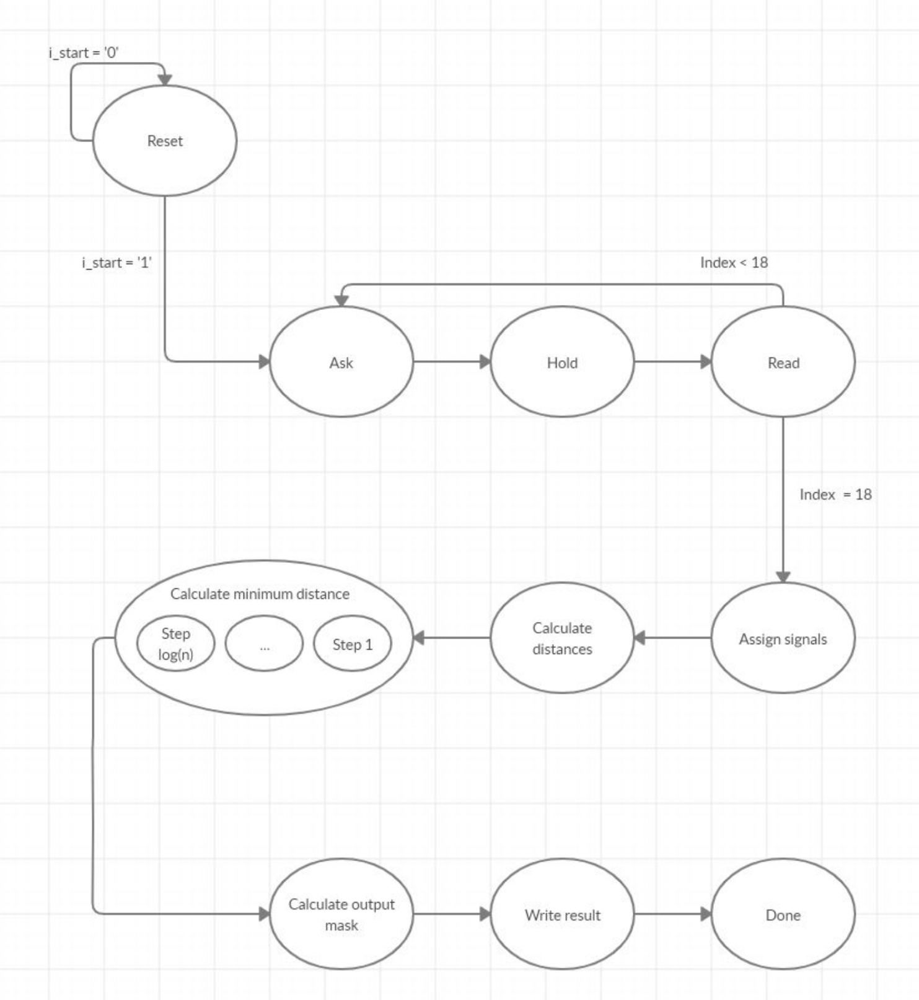
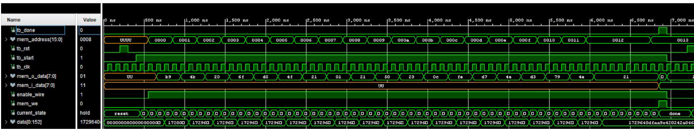

# Final project for logical networks course

Problem: Given 8 points and a 9th reference point in a 2D space (256x256) and an 8 bit mask that specifies which points to evaluate, create a mask that indicates which of the given points are at the minimum distance from the reference point.

Solution: We have to calculate of all the points from the reference one, calculate the minimum of these distances and generate the output mask. To calculate the distances we need the information on the points, but we can only read the data about one point at a time, therefore there are two possible choices:

1. recalculate the output mask every time a point is read
2. read the coordinates of all the points and then calculate distances and mask

I chose the second option, because it requires fewer operations and will be more energy efficient as well. We should note that executing fewer operations doesn't imply the system will be faster, in the first option it is possible to recalculate the mask and read a new point in parallel. The second option also requires more memory, because we have to store the coordinates of all the points.

This diagram describes the operation of the machine, each state takes one clock cycle:

In order to test the proper operation of the design I wrote a C program to generate test inputs.

This image illustrates the values of some signals during operation:

